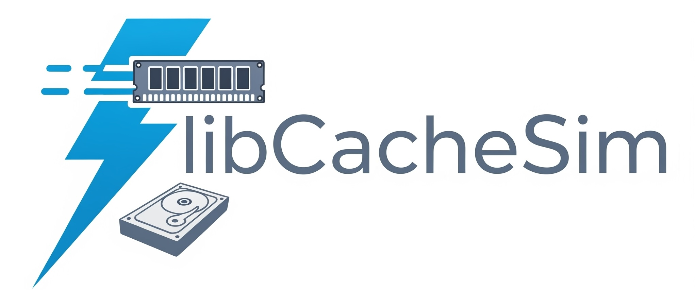

<p align="center">
  <picture>
    
  </picture>
</p>

<h3 align="center">
A high-performance library for building and running cache simulations
</h3>

---

[](https://github.com/1a1a11a/libCacheSim/actions/workflows/build.yml)
[](https://github.com/cacheMon/libCacheSim-python/actions/workflows/pypi-release.yml)
[](https://github.com/1a1a11a/libCacheSim/actions/workflows/npm-release.yml)
[](https://scorecard.dev/viewer/?uri=github.com/1a1a11a/libCacheSim)


## News
* **Aug 2025**: We compiled a list of open-source [cache datasets](https://github.com/cacheMon/cache_dataset).
* **Oct 2024**: **S3-FIFO** gets an upgrade! Please try out the new version (the old one is now named S3-FIFOv0).
* **Oct 2023**: **[S3-FIFO](https://dl.acm.org/doi/10.1145/3600006.3613147)** and **[SIEVE](https://sievecache.com)** are available! These are very simple algorithms that are very effective at reducing cache misses. Try them out in libCacheSim and in your production!
* **Jun 2023**: **QDLP** is available now, see [our paper](https://dl.acm.org/doi/10.1145/3593856.3595887) for details.
---

## What is libCacheSim
* **cachesim**, a high-performance cache simulator for running cache simulations.
* **traceAnalyzer**, a high-performance and versatile analyzer for cache traces.
* **libCacheSim**, a high-performance library for building your own cache simulators.

---

## libCacheSim features
* **High performance** - over 20M requests/sec for a realistic trace replay.
* **High memory efficiency** - predictable and small memory footprint.
* **State-of-the-art algorithms** - eviction algorithms, admission algorithms, prefetching algorithms, sampling techniques, approximate miss ratio computation, see [here](/doc/quickstart_cachesim.md).
* **Parallelism out-of-the-box** - uses the many CPU cores to speed up trace analysis and cache simulations.
* **The ONLY feature-rich trace analyzer** - all types of trace analysis you need, see [here](/doc/quickstart_traceAnalyzer.md).
* **Simple API** - easy to build cache clusters, multi-layer caching, etc.; see [here](/doc/API.md).
* **Extensible** - easy to support new trace types or eviction algorithms; see [here](/doc/advanced_lib_extend.md).
* **Efficient Miss Ratio Curve profiler** - quickly build highly accurate miss ratio curves on large-scale workloads; see [here](/doc/quickstart_mrcProfiler.md).

The full documentation index lives in [doc/README.md](/doc/README.md).

---

## Supported algorithms
The name in `code` is what you pass to `cachesim` on the command line (names are case-insensitive).

### Eviction algorithms
* [FIFO](/libCacheSim/cache/eviction/FIFO.c) `fifo`, [LRU](/libCacheSim/cache/eviction/LRU.c) `lru`, [Clock](/libCacheSim/cache/eviction/Clock.c) `clock`, [SLRU](/libCacheSim/cache/eviction/SLRU.c) `slru`, [Random](/libCacheSim/cache/eviction/Random.c) `random`, [RandomTwo](/libCacheSim/cache/eviction/RandomTwo.c) `randomtwo`
* [LFU](/libCacheSim/cache/eviction/LFU.c) `lfu`, [LFU with dynamic aging](/libCacheSim/cache/eviction/LFUDA.c) `lfuda`
* [ARC](/libCacheSim/cache/eviction/ARC.c) `arc`, [TwoQ](/libCacheSim/cache/eviction/TwoQ.c) `2q`, [CLOCK-PRO](/libCacheSim/cache/eviction/ClockPro.c) `clockpro`, [CAR](/libCacheSim/cache/eviction/CAR.c) `car`, [LIRS](/libCacheSim/cache/eviction/LIRS.c) `lirs`, [Clock2QPlus](/libCacheSim/cache/eviction/Clock2QPlus.c) `clock2qplus`
* [LRU-K](/libCacheSim/cache/eviction/cpp/LRU_K.cpp) `lru-k`, [LRU-Prob](/libCacheSim/cache/eviction/LRUProb.c) `lru-prob`, [Size](/libCacheSim/cache/eviction/Size.c) `size`
* [FIFO-Merge](/libCacheSim/cache/eviction/FIFO_Merge.c) `fifo-merge`
* [Belady](/libCacheSim/cache/eviction/Belady.c) `belady`, [BeladySize](/libCacheSim/cache/eviction/BeladySize.c) `beladysize` — these need future information, so they only work on oracle traces such as `oracleGeneral`
* [GDSF](/libCacheSim/cache/eviction/cpp/GDSF.cpp) `gdsf`
* [Hyperbolic](/libCacheSim/cache/eviction/Hyperbolic.c) `hyperbolic`
* [LeCaR](/libCacheSim/cache/eviction/LeCaR.c) `lecar`
* [Cacheus](/libCacheSim/cache/eviction/Cacheus.c) `cacheus`
* [LHD](/libCacheSim/cache/eviction/LHD/LHD_Interface.cpp) `lhd`
* [LRB](/libCacheSim/cache/eviction/LRB/LRB_Interface.cpp) `lrb` — build with `-DENABLE_LRB=ON`
* [GLCache](/libCacheSim/cache/eviction/GLCache/GLCache.c) `glcache` — build with `-DENABLE_GLCACHE=ON`
* [3LCache](/libCacheSim/cache/eviction/3LCache/) `3lcache` — build with `-DENABLE_3L_CACHE=ON`
* [WTinyLFU](/libCacheSim/cache/eviction/WTinyLFU.c) `wtinylfu`
* [QD-LP](/libCacheSim/cache/eviction/QDLP.c) `qdlp`
* [S3-FIFO](/libCacheSim/cache/eviction/S3FIFO.c) `s3fifo`, [S3-FIFOd](/libCacheSim/cache/eviction/S3FIFOd.c) `s3fifod`
* [Sieve](/libCacheSim/cache/eviction/Sieve.c) `sieve`

### Admission algorithms
* [Adaptsize](/libCacheSim/cache/admission/adaptsize/)
* [Bloomfilter](/libCacheSim/cache/admission/bloomfilter.c)
* [Prob](/libCacheSim/cache/admission/prob.c)
* [Size](/libCacheSim/cache/admission/size.c)
* [SizeProbabilistic](/libCacheSim/cache/admission/sizeProbabilistic.c)

### Prefetching algorithms
* [OBL](/libCacheSim/cache/prefetch/OBL.c)
* [Mithril](/libCacheSim/cache/prefetch/Mithril.c)
* [PG](/libCacheSim/cache/prefetch/PG.c)
---


## Build and Install libCacheSim
### One-line install
We provide some scripts for quick installation of libCacheSim.
```bash
cd scripts && bash ./install_dependency.sh && source ~/.bashrc && bash ./install_libcachesim.sh
# Replace ~/.bashrc with ~/.zshrc if you are using zsh on macos
```
If this does not work, please
1. let us know what system you are using and what error you get
2. read the following sections for self-installation.

<details>
<summary>Step-by-step installation guide </summary>

### Install dependency
libCacheSim uses the [cmake](https://cmake.org/) build system and has a few dependencies: [glib](https://developer.gnome.org/glib/), [tcmalloc](https://github.com/google/tcmalloc), [zstd](https://github.com/facebook/zstd).
Please see [install.md](/doc/install.md) for instructions on how to install the dependencies.


### Build libCacheSim
cmake recommends **out-of-source build**, so we do it in a new directory:
```bash
# Prerequisites: Install Ninja build system
# Ubuntu/Debian: sudo apt install ninja-build
# macOS: brew install ninja
# CentOS/RHEL: sudo yum install ninja-build

git clone https://github.com/1a1a11a/libCacheSim
pushd libCacheSim
mkdir _build && cd _build
cmake -G Ninja .. && ninja
[sudo] ninja install
popd
```
</details>


<details>
<summary> Developer setup </summary>

### Developer Setup
If you contribute to libCacheSim, we provide tools to ensure code quality and consistent formatting:

#### Pre-commit Hooks
We provide a git pre-commit hook that runs linting checks before each commit, helping catch issues early:

```bash
# Install the pre-commit hook
bash scripts/setup_hooks.sh
```

The pre-commit hook:
- Checks formatting with clang-format (if available)
- Runs clang-tidy static analysis in parallel
- Compiles modified files with strict compiler warnings enabled
- Prevents committing code with formatting, static analysis, or compiler issues
- Logs are preserved for debugging in `.lint-logs/` directory

</details>

---

## Usage
### cachesim (a high-performance cache simulator)
After building and installing libCacheSim, `cachesim` should be in the `_build/bin/` directory.
The `cachesim` commands in this section are run from `_build/`, so the sample traces in [data/](/data/) are at `../data/`. The debug and plotting scripts further below are run from the repository root instead.
#### basic usage
```
./bin/cachesim trace_path trace_type eviction_algo cache_size [OPTION...]
```

use `./bin/cachesim --help` to get more information.

#### Run a single cache simulation
Run the example traces using the LRU eviction algorithm and a 1 GB cache size.

```bash
# Note that there is no space between the cache size and the unit, and the unit is not case-sensitive
./bin/cachesim ../data/cloudPhysicsIO.vscsi vscsi lru 1gb
```

#### Run multiple cache simulations with different cache sizes
```bash
# Note that there is no space between the cache sizes
./bin/cachesim ../data/cloudPhysicsIO.vscsi vscsi lru 1mb,16mb,256mb,8gb

# Besides absolute cache size, you can also use a fraction of the working set size
./bin/cachesim ../data/cloudPhysicsIO.vscsi vscsi lru 0.001,0.01,0.1,0.2

# besides using byte as the unit, you can also treat all objects as having the same size, and the size is the number of objects
./bin/cachesim ../data/cloudPhysicsIO.vscsi vscsi lru 1000,16000 --ignore-obj-size 1

# use a csv trace, note the quotation marks when you have multiple options
./bin/cachesim ../data/cloudPhysicsIO.csv csv lru 1gb -t "time-col=2, obj-id-col=5, obj-size-col=4, obj-id-is-num=true"

# use a csv trace with more options
./bin/cachesim ../data/cloudPhysicsIO.csv csv lru 1gb -t "time-col=2, obj-id-col=5, obj-size-col=4, obj-id-is-num=true, delimiter=,, has-header=true"
```

Object ids are hashed unless you tell the reader they are already numeric, so add `obj-id-is-num=true` when the id column holds numbers — `cachesim` stops with an error if you leave it out on such a trace.

See [quick start cachesim](/doc/quickstart_cachesim.md) for more usages.

#### Debug cachesim
We provide a debug script to help you debug cachesim with GDB. For detailed usage instructions, see [debug guide](/doc/debug.md). Run it from the repository root:

```bash
# Basic usage
./scripts/debug.sh

# Debug with program arguments
./scripts/debug.sh -- data/cloudPhysicsIO.vscsi vscsi lru,s3fifo 100mb,1gb
```

#### Plot miss ratio curve
You can plot miss ratios of different algorithms and sizes, and plot the miss ratios over time.
These scripts need the Python dependencies in [requirements.txt](/requirements.txt) (`pip install -r requirements.txt`), and are run from `scripts/` in the repository root.

```bash
# plot miss ratio over size
cd scripts
python3 plot_mrc_size.py --tracepath ../data/twitter_cluster52.csv --trace-format csv --trace-format-params="time-col=1,obj-id-col=2,obj-size-col=3,obj-id-is-num=1" --algos=fifo,lru,lecar,s3fifo --sizes=0.001,0.002,0.005,0.01,0.02,0.05,0.1,0.2,0.3,0.4

# plot miss ratio over time
python3 plot_mrc_time.py --tracepath ../data/twitter_cluster52.csv --trace-format csv --trace-format-params="time-col=1,obj-id-col=2,obj-size-col=3,obj-id-is-num=1" --algos=fifo,lru,lecar,s3fifo --report-interval=30 --miss-ratio-type="accu"

# plot miss ratio over size using SHARDS
python3 plot_appr_mrc.py SHARDS ../data/cloudPhysicsIO.vscsi vscsi 0.01

# plot miss ratio over size using Miniature Simulations
python3 plot_appr_mrc.py MINI ../data/cloudPhysicsIO.vscsi vscsi s3fifo "0.01,0.05,0.1,0.2" 0.1 --extra_args "--ignore-obj-size 1"
```

---

### Trace analysis
libCacheSim also has a trace analyzer that provides a lot of useful information about the trace.
It is very fast and designed to work with billions of requests, and it comes with a set of scripts to help you analyze the results.

```bash
./bin/traceAnalyzer ../data/cloudPhysicsIO.vscsi vscsi --common
```

See [trace analysis](/doc/quickstart_traceAnalyzer.md) for more details.

---

### Miss ratio curves profiling

Constructing fine-grained miss ratio curves for large-scale workloads is very demanding on CPU and memory resources. libCacheSim provides advanced miss ratio curve profiling tools to help you quickly build miss ratio curves for large-scale workloads. See [mrcProfiler](/doc/quickstart_mrcProfiler.md) for more details.

---

### Using libCacheSim as a library
libCacheSim can be used as a library for building cache simulators.
For example, you can build a cache cluster with consistent hashing or a multi-layer cache simulator.

<details>
<summary> See a code example </summary>

Here is a simplified example showing the basic APIs.
```c
#include <libCacheSim.h>
#include <stdio.h>

int main(int argc, char *argv[]) {
    /* open trace, see quickstart_lib.md for opening csv and binary trace */
    reader_t *reader = open_trace("../data/cloudPhysicsIO.vscsi", VSCSI_TRACE, NULL);

    /* create a container for reading from trace */
    request_t *req = new_request();

    /* create an LRU cache */
    common_cache_params_t cc_params = default_common_cache_params();
    cc_params.cache_size = 1 * MiB;
    cache_t *cache = LRU_init(cc_params, NULL);

    /* counters */
    uint64_t n_req = 0, n_miss = 0;

    /* loop through the trace */
    while (read_one_req(reader, req) == 0) {
        if (!cache->get(cache, req)) {
            n_miss++;
        }
        n_req++;
    }

    printf("miss ratio: %.4lf\n", (double)n_miss / n_req);

    /* cleaning */
    close_trace(reader);
    free_request(req);
    cache->cache_free(cache);

    return 0;
}
```

Save this to `test.c` and compile it with the command below. For `libCacheSim.h` to work correctly, we need the following libs to be installed first: [glib](https://developer.gnome.org/glib/) and [zstd](https://github.com/facebook/zstd). Please refer to the previous section, [Installation](#install-dependency).
```bash
gcc test.c $(pkg-config --cflags --libs libCacheSim glib-2.0) -o test.out -lm -lzstd
```
To run the executable (the trace path above is relative, so run it from a directory next to `data/`, e.g. `_build/`),
```bash
./test.out
```
</details>

See [here](/doc/advanced_lib.md) for more details, and see the [example folder](/example) for examples of how to use libCacheSim, such as building a cache cluster with consistent hashing or multi-layer cache simulators.

---


### Extending libCacheSim (new algorithms and trace types)
libCacheSim supports *txt*, *csv*, and *binary* traces. We prefer binary traces because they allow libCacheSim to run faster, and the traces are more compact.

We also support zstd compressed binary traces without decompression. This allows you to store the traces with less space.

If you need to add a new trace type or a new algorithm, please see [here](/doc/advanced_lib_extend.md) for details.

We encourage users to check [deepWiki](https://deepwiki.com/1a1a11a/libCacheSim) for more detailed documentation.

---
## Python package

If you are not extremely sensitive to performance, our Python binding offers an easier way to access the core features of libCacheSim.

```shell
pip install libcachesim
```


### Simulation with python

```python
from libcachesim import SyntheticReader, TraceReader, FIFO

reader = SyntheticReader(num_objects=1000, num_of_req=10000, alpha=1.0, dist="zipf") # synthetic trace
# reader = TraceReader("./data/cloudPhysicsIO.oracleGeneral.bin") # real trace
cache = FIFO(cache_size=1024*1024)
obj_miss_ratio, byte_miss_ratio = cache.process_trace(reader)
print(f"Obj miss ratio: {obj_miss_ratio:.4f}, byte miss ratio: {byte_miss_ratio:.4f}")
```

### Extending new algorithm

With the Python package, you can implement a new eviction algorithm and test your own design **without any C/C++ compilation**.
<details>
<summary> See an example below </summary>

```python
from collections import OrderedDict
from typing import Any

from libcachesim import PluginCache, SyntheticReader, LRU, CommonCacheParams, Request

def init_hook(_: CommonCacheParams) -> Any:
    return OrderedDict()

def hit_hook(data: Any, req: Request) -> None:
    data.move_to_end(req.obj_id, last=True)

def miss_hook(data: Any, req: Request) -> None:
    data.__setitem__(req.obj_id, req.obj_size)

def eviction_hook(data: Any, _: Request) -> int:
    return data.popitem(last=False)[0]

def remove_hook(data: Any, obj_id: int) -> None:
    data.pop(obj_id, None)

def free_hook(data: Any) -> None:
    data.clear()


plugin_lru_cache = PluginCache(
    cache_size=128,
    cache_init_hook=init_hook,
    cache_hit_hook=hit_hook,
    cache_miss_hook=miss_hook,
    cache_eviction_hook=eviction_hook,
    cache_remove_hook=remove_hook,
    cache_free_hook=free_hook,
    cache_name="Plugin_LRU",
)

reader = SyntheticReader(num_objects=1000, num_of_req=10000, obj_size=1, alpha=1.0, dist="zipf")
req_miss_ratio, byte_miss_ratio = plugin_lru_cache.process_trace(reader)
ref_req_miss_ratio, ref_byte_miss_ratio = LRU(128).process_trace(reader)
print(f"plugin req miss ratio {req_miss_ratio}, ref req miss ratio {ref_req_miss_ratio}")
print(f"plugin byte miss ratio {byte_miss_ratio}, ref byte miss ratio {ref_byte_miss_ratio}")
```

</details>

See more information in the [README.md](https://github.com/cacheMon/libCacheSim-python) of the Python binding.

---
## Node.js package

Node.js bindings are also available. Releases ship a pre-compiled binary for Linux x64; on other platforms `npm install` falls back to building from source, which needs the build dependencies above.

```shell
npm install libcachesim-node
```

```javascript
const { runSimulation } = require('libcachesim-node');

const result = runSimulation('/path/to/trace.vscsi', 'vscsi', 's3fifo', '1mb');
```

See [libCacheSim-node](/libCacheSim-node/) for the full API and the bundled `cachesim-js` CLI.

---
## Open source cache traces
In the [repo](/data/), there are sample traces in different formats (`csv`, `txt`, `vscsi`, `lcs`, and `oracleGeneral`). Note that the sample traces are **very small** and __should not be used for evaluating different algorithms' miss ratios__. The full traces can be found either with the original release or in the processed `oracleGeneral` format.

Note that the oracleGeneral traces are compressed with [zstd](https://github.com/facebook/zstd) and have the following format:

```c
struct {
    uint32_t clock_time;
    uint64_t obj_id;
    uint32_t obj_size;
    int64_t next_access_vtime;  // -1 if no next access
}
```
The compressed traces can be used with libCacheSim without decompression. And libCacheSim provides a `tracePrint` tool to print the trace in a human-readable format.

We provide more comprehensive cache datasets at [https://github.com/cacheMon/cache_dataset](https://github.com/cacheMon/cache_dataset).


---
## Contributions
We gladly welcome pull requests. See [CONTRIBUTING.md](/CONTRIBUTING.md) for how to build, test, and submit changes, and [doc/advanced_lib_extend.md](/doc/advanced_lib_extend.md) for adding a new algorithm or trace reader.

Before making any large changes, we recommend opening an issue and discussing your proposed changes.
If the changes are minor, then feel free to make them without discussion.
This project adheres to Google's coding style, and participants are expected to follow our [Code of Conduct](/CODE_OF_CONDUCT.md).

Found a security issue? Please report it privately — see [SECURITY.md](/SECURITY.md).

---
## Reference
<details>
<summary> Please cite the following papers if you use libCacheSim. </summary>

```
@inproceedings{yang2020-workload,
    author = {Juncheng Yang and Yao Yue and K. V. Rashmi},
    title = {A large-scale analysis of hundreds of in-memory cache clusters at Twitter},
    booktitle = {14th USENIX Symposium on Operating Systems Design and Implementation (OSDI 20)},
    year = {2020},
    isbn = {978-1-939133-19-9},
    pages = {191--208},
    url = {https://www.usenix.org/conference/osdi20/presentation/yang},
    publisher = {USENIX Association},
}

@inproceedings{yang2023-s3fifo,
  title = {FIFO Queues Are All You Need for Cache Eviction},
  author = {Juncheng Yang and Yazhuo Zhang and Ziyue Qiu and Yao Yue and K.V. Rashmi},
  isbn = {9798400702297},
  publisher = {Association for Computing Machinery},
  booktitle = {Symposium on Operating Systems Principles (SOSP'23)},
  pages = {130–149},
  numpages = {20},
  year={2023}
}

@inproceedings{yang2023-qdlp,
  author = {Juncheng Yang and Ziyue Qiu and Yazhuo Zhang and Yao Yue and K.V. Rashmi},
  title = {FIFO Can Be Better than LRU: The Power of Lazy Promotion and Quick Demotion},
  year = {2023},
  isbn = {9798400701955},
  publisher = {Association for Computing Machinery},
  doi = {10.1145/3593856.3595887},
  booktitle = {Proceedings of the 19th Workshop on Hot Topics in Operating Systems (HotOS23)},
  pages = {70–79},
  numpages = {10},
}
```
If you used libCacheSim in your research, please cite the above papers.

</details>

GitHub's **Cite this repository** button uses [CITATION.cff](/CITATION.cff); [references.md](/references.md) has the same entries as BibTeX, including the SIEVE paper.

---


## License
libCacheSim is licensed under the [Apache License 2.0](LICENSE).

## Related
* [PyMimircache](https://github.com/1a1a11a/PyMimircache): a python based cache trace analysis platform, now deprecated
---
